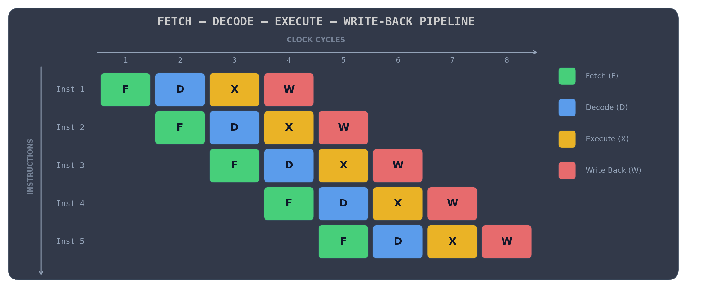
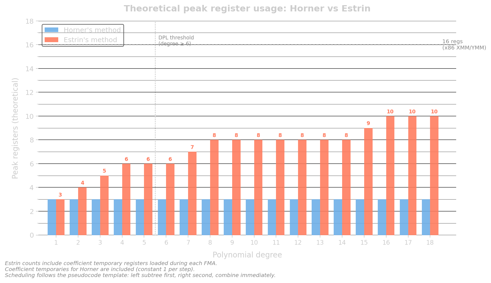

# Optimization of Polynomial Evaluations

> This documentation was written by the author and refined with the assistance of AI-based editing tools for clarity and readability.

While looking up how to implement some of the elementary/trigonometric functions found in cmath or in the [math submodule](../include/dpl/core/math); I stumbled upon the SIMD Library for Elementary Functions (SLEEF). It is in this library where I stumbled upon a set of hardcoded [preprocessor macros](https://github.com/shibatch/sleef/blob/master/src/common/estrin.h) evaluating polynomial functions. Thanks to it's very helpful comment, this led to my own discovery of Estrin's method for polynomial evaluation. While there are various improvements over Estrin, this article will focus mainly on the canonical Estrin form.

From there, I started digging into how polynomial evaluation strategies differ in practice, and how they map onto SIMD execution. This document goes on to describe an experimental tuning process applied to an implementation of Estrin’s method, with the goal of improving the quality of the assembly generated by Clang and GCC for SIMD execution.

Before getting into the tuning itself, there is a fair amount of oversimplified background and preamble on polynomials and evaluation strategies, and why they behave differently on modern CPUs. If you’re already familiar with these concepts, you can safely skip ahead to the [next chapter](./02-baseline.md).

> **Note:** This write-up is not strictly chronological. Most of the optimization work was done while focusing on Clang, with GCC comparisons added later during the writing process.

## Polynomials

A polynomial is an expression of the form:

$$
f(x) = a_0 + a_1 x + a_2 x^2 + \dots + a_n x^n
$$

where the coefficients $a_i$ are constants and $x$ is the variable. Evaluating such expressions efficiently is a common requirement in numerical computing, especially for transcendental function approximations. If you remember high school calculus, you can approximate many functions using an infinite sum of derivatives at a single point, AKA Taylor's series. For example:

$$
\exp(x) = 1 + x + \frac{x^2}{2!} + \frac{x^3}{3!} + \cdots
$$


The number of terms in a polynomial approximation directly affects its accuracy. In general, more terms allow the approximation to better match the target function over a given range, since higher-degree polynomials can capture more of the function’s curvature. However, this comes with diminishing returns (and also gets quite expensive!).

In practice, Taylor series is rarely used directly for implementing elementary functions in performance-critical code. While it’s useful as a theoretical tool, it is not optimal for minimax approximation over an interval. Instead, most high-performance math libraries use polynomial approximations generated via the [Remez algorithm](https://en.wikipedia.org/wiki/Remez_algorithm), which produces polynomials that minimize the maximum error over a specified range ([minmax polynomials](https://en.wikipedia.org/wiki/Minimax_approximation_algorithm)).

I won’t pretend I understand Remez in any deep sense. At this point, I basically just had an LLM generate some very buggy Python code to compute the coefficients and used that as a starting point.

### Horner's Method

A straightforward evaluation of polynomials would compute each power of x independently, but this is inefficient due to redundant multiplications. A standard improvement is Horner’s method, which rewrites the polynomial in nested form:

$$
f(x) = a_0 + x (a_1 + x ( a_2 + \dots + x (a_n)...))
$$

When evaluating Horner's method, a common instruction-level optimization is to use fused multiply-add (FMA) operations, which computes `a * b + c` in one instruction. These instructions will typically cost the same as a multiplication instruction and can be faster since it performs both operations in a single instruction, improving pipeline utilization by reducing instruction count and data dependency, as well as avoiding intermediate rounding and write-back overhead.

So FMAs are great, but how does it scale? Take for example, a 6th degree polynomial:
 
```python
result = a6

result = fma(result, x, a5)
result = fma(result, x, a4)
result = fma(result, x, a3)
result = fma(result, x, a2)
result = fma(result, x, a1)
result = fma(result, x, a0)
```
Each step in Horner’s method depends on the result of the previous one, forming a strict dependency chain of FMAs. This means that every instruction must wait for the previous one to complete before it can begin.

To understand why this matters, it helps to briefly recall how modern CPUs execute instructions. At a high level, instructions go through a [fetch–decode–execute cycle](https://en.wikipedia.org/wiki/Instruction_cycle), but these stages are typically **pipelined**. This allows multiple instructions to be in different stages of execution at the same time, improving overall throughput by overlapping work.



> [!NOTE]
> It’s worth noting that this is an over-simplification of how real processors work. Modern CPU frontends and execution engines are significantly more complex. Off the top of my head, there are mechanisms like instruction fusion, micro-op caches, speculative execution, register renaming, etc. None of which I can really explain in detail if pressed. The fetch–decode–execute model is still useful as a mental picture.

However, pipelining does not eliminate data dependencies. The diagram above shows 4 independent instructions being pipelined and executed by an idealized CPU.

If an instruction depends on the result of a previous one, it cannot proceed until that result becomes available, regardless of how well the pipeline is utilized. How this would like like in the diagram above is that certain instructions may have the execution and write-back blocks shifted right as they wait for the writeback of a previous instruction to complete.

In practice, executions also do not take only a single cycle as the diagram would suggest; different instructions have different execution latencies. In particular, FMAs on x86 is [documented](https://uops.info/table.html) by Intel and AMD to take ~4 cycles. As dependency chains grow longer, these delays accumulate quickly.

In Horner’s method, each FMA depends directly on the previous result, forming a strict dependency chain. As a result, the pipeline frequently stalls waiting for data, and execution becomes effectively latency-bound, with each step incurring the full FMA latency. As the polynomial degree increases, the dependency chain grows longer, and there is no opportunity to overlap work or hide latency.

To address this, we need a different way of structuring the computation that exposes more parallelism in the evaluation itself.

### Estrin's Method

Estrin's method, in contrast to a chain of polynomials in Horner's, converts the evaluation structure into a binary tree, where each level of the tree groups terms by $x^{2n}$ in progressively larger blocks, evaluates these sub-expressions independently, and then combines the results upwards.

$$
f(x) =
\sum_{k=0}^{\lfloor n/2 \rfloor}
(a_{2k} + a_{2k+1}x)\,x^{2k}
$$

In pseudocode, it looks something like:

```python
def estrin(x_powers, coeff, B, L):
    """
    x_powers: [x^1, x^2, x^4, x^8, ...]
    coeff: polynomial coefficients
    B: base index into coeff
    L: level (log2 stride depth)
    """

    S =  1 << L # base index stride
    # leaf node
    if L == 0:
        if B + S <= degree:
            return fma(x_powers[0], coeff[B + S], coeff[B])
        else:
            return coeff[B]

    # recursive Estrin split
    if B + S <= degree:
        left  = estrin(x_powers, coeff, B + S, L - 1, S >> 1)
        right = estrin(x_powers, coeff, B,     L - 1, S >> 1)

        return fma(x_powers[L], left, right)

    # fallback: skip invalid region
    return estrin(x_powers, coeff, B, L - 1, S >> 1)
```

Obviously, loops/recursive functions are not ideal for high-throughput SIMD computations. In practice, SLEEF avoids this by using preprocessor expansions with a fixed limit (up to degree 20). In contrast, I’ve opted to make the implementation fully general using template metaprogramming. In reality, it’s unlikely to encounter polynomials of that size in the wild — I don’t think any of the elementary functions used in DPL even come close to degree 20. However, the template metaprogramming later became quite useful in the tuning process for the Estrin evaluation in DPL since I can structurally identify which part of the Estrin tree I am currently in with the constants `B` and `L`.

Using the same 6th degree polynomial as before in the Horner example:

```python
x2 = x * x
x4 = x2 * x4

t1 = a2 + a3 * x
t0 = a0 + a1 * x
u0 = t0 + t1 * x2

t2 = a4 + a5 * x
u1 = t2 + a6 * x2

result = u0 + u1 * x4

```

How does this help exactly? Because the tree structure generates sub-expressions that can be executed independently, we can more efficiently make use of the execution pipeline. By dispatching independent FMAs, we can fill pipeline with sequences of instructions that can execute without needing to wait for a previous result.

As the recursion moves up the tree to merge results, the number of independent operations decreases, but the overall dependency depth remains much smaller than in Horner’s method. This allows more work to be overlapped earlier in the computation, reducing the impact of latency and improving throughput. Unlike Horner’s method, where each step depends on the previous one, Estrin produces groups of operations that do not depend on each other and can therefore be executed concurrently. This restructuring exposes **instruction-level parallelism (ILP)**. ILP doesn't necessarily describes parallelism in an actual sense but it describes *potential* of excuting instruction in parallel as a result of their independence to one another.

Here's where modern CPUs (e.g. x86, and many newer ARM and RISC-V designs) start to feel almost like science fiction.

Modern CPUs, don't really care about program order; you can think of it more as a set of "guidelines" than actual rules. Through a mechanism called [out-of-order execution](https://en.wikipedia.org/wiki/Out-of-order_execution), the processor can dynamically reorder instructions at runtime, executing any instruction whose inputs are ready, regardless of where it appears in the original sequence.

In practice, this means the high ILP nature of Estrin allows the CPU to "jump around" the evaluation tree, pulling in independent work from different branches to keep the execution units busy. Even as parallelism decreases at higher levels, the processor continues to find and schedule useful work, aggressively hiding latency in a way that feels almost unreal.

Referring to the pseudocode above, in an ideal out-of-order[^ideal-ooo] scenario, the CPU could potentially issue the independent evaluations of `t0`, `t1`, and `t2` as soon as their inputs are available, *regardless* of their original program order. This allows their execution to overlap with later stages of the computation, such as the evaluation of `u0` and `u1`, effectively hiding some of the FMA latency and increasing overall utilization of the execution units.

So far, Estrin has been analyzed from a purely theoretical perspective: ILP, pipeline utilization, and latency overlap. Like all optimizations, while Estrin introduces a number of attractive benefits, it also introduces a number of disadvantages.

**Low-degree inefficiency**: The ILP benefit only materializes when there is enough independent work to keep the execution units busy. At low polynomial degrees, the tree is too shallow to provide it. FMA latencies are typically ~4 cycles, and if the instruction stream can't fill that window with independent work, the pipeline stalls. Estrin also requires computing $x^{2k}$ up front — adding a dependency chain of its own without contributing useful parallel work. Performance at low degrees can end up matching Horner's, or worse. DPL sets a threshold at degree 6 for this reason.

> [!NOTE]
> This is also why Estrin is often less useful in single-precision (FP32) implementations of elementary functions. In FP32, the limited precision (~7 decimal digits) means that low-degree polynomials are usually sufficient over well-conditioned intervals. Adding more terms often just introduces more operations and rounding error without improving accuracy.

**Numerical Instability:** Estrin is not as numerically stable as Horner's method. The tree structure evaluates sub-expressions independently and combines them at higher levels, which can introduce more rounding error than Horner's sequential accumulation.

**Higher instruction count.** Unlike Horner's method, Estrin doesn't reduce the number of FMAs — it performs the same number, plus the additional multiplications for the $x^{2k}$ powers. More instructions means more potential for scheduling pressure and a larger instruction footprint overall.
 
**Register pressure.** Estrin's tree structure requires holding multiple intermediate results live simultaneously — the $x^{2k}$ powers must persist throughout the evaluation, and deeper subtrees keep more values live for longer. The higher the degree, the worse this gets.
 

 
**Sparse polynomials.** Like Horner's method, the basic Estrin form does not handle sparse polynomials (those with many zero coefficients) any more efficiently than dense ones.

While various modifications and extensions to Estrin's method have been devised to address these shortcomings, I'm not going to cover any of them here.

[^ideal-ooo]: In reality, other things (e.g. scheduling, physical register count, whether full overlap is possible, etc.) may limit how much parallel execution is possible. Again, none of which I actually know in-depth to explain in detail.

[^avx512]: AVX-512 extends the SIMD register file from 16 to 32 registers. While this doubles the number of available registers, it is not universally available on all CPUs.

## The Goal

Although I haven't gotten around to evaluating any other polynomial evaluation strategies, the canonical form of Estrin and Horner is good enough for SLEEF, which is a well-known SIMD library that implements many of the basic elementary functions found in `cmath`. That is sufficient justification for DPL to adopt it as well. DPL is also designed to be extensible, so if a better strategy is ever needed, users can inject their own implementation.

The one shortcoming I could not ignore was register pressure.

Register pressure matters because a polynomial evaluation never exists in isolation. It is always one step within a larger routine. In practice, there are operations both before and after the evaluation.

For example, consider the trigonometric functions, `sin`/`cos`. Preprocessing typically involves argument reduction (e.g. reducing the input modulo π), while postprocessing may include sign adjustments, quadrant corrections, and special-case handling for NaNs, infinities, and so on.

The more registers the polynomial consumes, the fewer are available for everything around it. In the worst case, the compiler is forced to spill values to the stack, reloading them as needed — introducing memory latency and consuming bandwidth in what would otherwise be a purely register-bound computation.

This could potentially degrade the performance of the surrounding code, not just the polynomial evaluation itself.
 
When I compiled DPL's original implementation with Clang — and with GCC at certain optimization levels — the generated code was keeping more values live than necessary. This was done using compiler explorer to compile the polynomial function in isolation. So this suboptimal output may partly be a consequence of the compiler seeing without the broader calling context that might otherwise guide better scheduling decisions. But I did not want to leave that to chance.

Although C++ has no concept of registers, with enough experience, you start to recognise how certain code patterns map to machine code, and from there it becomes possible to influence register use indirectly. The key levers are value lifetime and evaluation order, i.e. controlling when a value is materialised and how long it stays live. This was not a particularly difficult problem to reason about, and the solution turned out to be a matter of careful lifetime management and with a splash of C++ templates.

This ties in to the broader motivation behind this optimization.

DPL is a library. It will not be the only code running in a user's program, and I want the compiled output to leave as much room as possible for the compiler to optimize the surrounding context. The goal isn't inventing a new evaluation scheme, but examining how the structure of Estrin's method interacts with the compiler, and introducing a small number of structural changes that reduce register pressure in the compiled output. We will primarily be looking at x86, with occasional reference to ARM.
 
