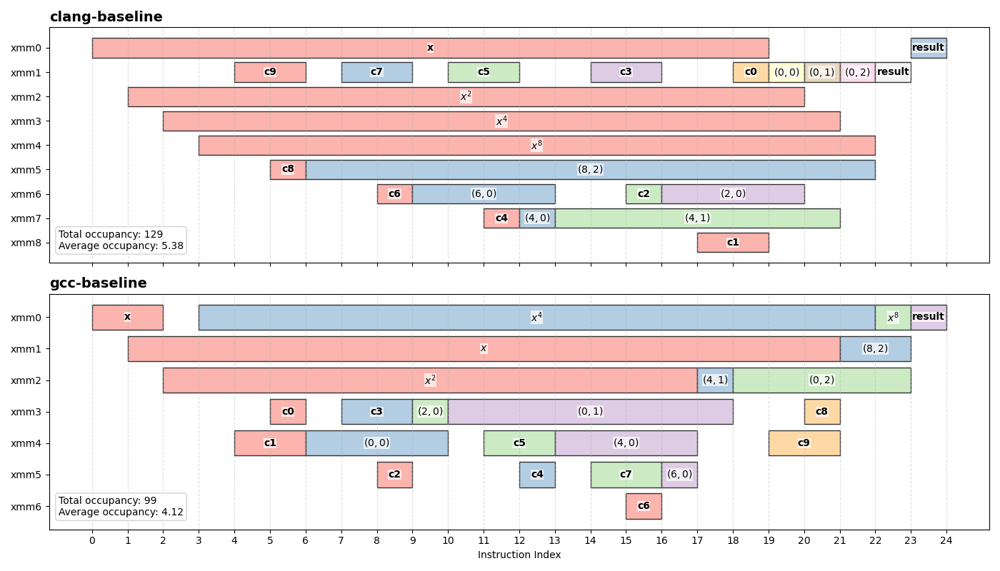

# Establishing the Baseline

Before making any changes, it’s worth understanding what the compiler is already doing whn compiling an polynomial evaluation using Estrin's scheme.

In this section, we establish a baseline for Estrin evaluation, introduce a way to visualize register usage, and identify where the inefficiencies come from.

For those who may want to play around with the code without diving deep into DPL, you can use [this compiler explorer link](https://godbolt.org/z/3f5jsGvba). Do note, that the code in the link only contains the final optimized code and the SLEEF baseline, so modifications will be needed if it's used to follow along.

## Baseline

To keep things concrete, we’ll mostly work with a single example. The example needs to be large enough that the structural changes are visible, but small enough that the assembly is still (somewhat) easy to follow. A 9th-degree polynomial (10 coefficients) will therefore be used.

The following ASCII tree shows the evaluation structure, where each node is annotated with the base coefficient index `B` and the tree level `L`. Throughout the articles, nodes in the Estrin trees will typically be addressed as `(B, L)`.

```txt
(B=0,  L=3)
├── (B=0,  L=2)
│   ├── (B=4,  L=1)
│   │   ├── (B=6,  L=0)
│   │   └── (B=4,  L=0)
│   └── (B=0,  L=1)
│       ├── (B=2,  L=0)
│       └── (B=0,  L=0)
└── (B=8,  L=2)
    └── (B=8,  L=1)
        └── (B=10,  L=0)
```

Using SLEEF’s POLY10 implementation, Clang 22.1.0 produces the following assembly for all optimization levels above 1:

```asm
clang_sleef_9(float vector[4]):
        vmulps  xmm2, xmm0, xmm0
        vmulps  xmm3, xmm2, xmm2
        vmulps  xmm4, xmm3, xmm3
        vbroadcastss    xmm1, dword ptr [rip + .LCPI2_0]
        vbroadcastss    xmm5, dword ptr [rip + .LCPI2_1]
        vfmadd213ps     xmm5, xmm0, xmm1
        vbroadcastss    xmm1, dword ptr [rip + .LCPI2_2]
        vbroadcastss    xmm6, dword ptr [rip + .LCPI2_3]
        vfmadd213ps     xmm6, xmm0, xmm1
        vbroadcastss    xmm1, dword ptr [rip + .LCPI2_4]
        vbroadcastss    xmm7, dword ptr [rip + .LCPI2_5]
        vfmadd213ps     xmm7, xmm0, xmm1
        vfmadd231ps     xmm7, xmm2, xmm6
        vbroadcastss    xmm1, dword ptr [rip + .LCPI2_6]
        vbroadcastss    xmm6, dword ptr [rip + .LCPI2_7]
        vfmadd213ps     xmm6, xmm0, xmm1
        vbroadcastss    xmm8, dword ptr [rip + .LCPI2_8]
        vbroadcastss    xmm1, dword ptr [rip + .LCPI2_9]
        vfmadd213ps     xmm1, xmm0, xmm8
        vfmadd231ps     xmm1, xmm2, xmm6
        vfmadd231ps     xmm1, xmm3, xmm7
        vfmadd231ps     xmm1, xmm4, xmm5
        vmovaps xmm0, xmm1
        ret
```

GCC 15.2 generates something a bit different on optimization level 1:

```asm
gcc_sleef_9(float vector[4]):
        vmovaps xmm1, xmm0
        vmulps  xmm2, xmm0, xmm0
        vmulps  xmm0, xmm2, xmm2
        vbroadcastss    xmm4, DWORD PTR .LC1[rip]
        vbroadcastss    xmm3, DWORD PTR .LC3[rip]
        vfmadd132ps     xmm4, xmm3, xmm1
        vbroadcastss    xmm3, DWORD PTR .LC5[rip]
        vbroadcastss    xmm5, DWORD PTR .LC7[rip]
        vfmadd132ps     xmm3, xmm5, xmm1
        vfmadd132ps     xmm3, xmm4, xmm2 
        vbroadcastss    xmm4, DWORD PTR .LC9[rip]
        vbroadcastss    xmm5, DWORD PTR .LC11[rip]
        vfmadd132ps     xmm4, xmm5, xmm1
        vbroadcastss    xmm5, DWORD PTR .LC13[rip]
        vbroadcastss    xmm6, DWORD PTR .LC15[rip]
        vfmadd132ps     xmm5, xmm6, xmm1
        vfmadd132ps     xmm2, xmm4, xmm5
        vfmadd132ps     xmm2, xmm3, xmm0
        vbroadcastss    xmm4, DWORD PTR .LC17[rip]
        vbroadcastss    xmm3, DWORD PTR .LC19[rip]
        vfmadd132ps     xmm1, xmm3, xmm4
        vmulps  xmm0, xmm0, xmm0
        vfmadd132ps     xmm0, xmm2, xmm1
        ret
```

> [!NOTE]
> For GCC, all assembly outputs/charts are generated from GCC 15.2 assembly outputs with options `-O1 -mavx2 -mfma`. Higher optimization level generates something different which I will be covering at the end (or you can skip to [part 5](./05-gcc-and-memory-loads)).
> For Clang (22.1.0), it doesn't matter which optimization level is selected, they all output the same.

## Value Lifetime

To make this easier to reason about, I’m also going to use what I’ll call a *lifetime chart*. It tracks how values flow through registers over the course of the evaluation.

The horizontal axis loosely represents program order, while the vertical axis corresponds to registers. Each horizontal segment shows the lifetime of a value: it begins when the value is written to a register and ends at its final use. The segments are labeled accordingly. For the partial results, I use the `(B, L)` notation from the Estrin tree diagram introduced earlier.

This chart also includes short-lived temporaries, such as the registers used to broadcast coefficients before feeding them into FMAs. These values tend to live for only a couple of instructions, but they still contribute to the overall picture.



The chart above is a plot of register usage for the assembly snippets from before.

One useful way to reason about register pressure from the lifetime chart is to draw a vertical line through the chart and count how many live segments it intersects. The maximum number of intersections at any point gives the peak number of simultaneously live values, which is a fair approximation of the actual register pressure.

This perspective also helps explain *why* the peak occurs. For example, are the contributing values long-lived intermediates, or is the spike caused by a few short-lived temporaries, such as registers used to pass coefficients into an FMA? In other words, it distinguishes between pressure arising from the structure of the computation and pressure caused by temporary effects.

In addition to the peak, we can define a second metric: total occupancy. Referring to the chart, this corresponds to the total area covered by all the colored blocks. It captures how long values remain live across the entire execution, giving a sense of the overall register pressure rather than just the worst-case moment.

From this, we can also derive the average number of live values by dividing the total occupancy by the length of the execution (essentially horizontal length of the chart). This reflects how “busy” the registers are on average.

Together, these metrics provide a more complete picture: the peak determines how many registers are required at minimum, while the total occupancy and average occupancy capture how efficiently those registers are utilized over time.

These metrics also loosely relate to another important resource: physical registers.

When talking about "limited registers" in most context, we usually refer to the **architectural registers**. These are the set of registers defined by the instruction set architecture (ISA) that a program can directly read and write (e.g. XMM, YMM, rax, etc. on x86). They represent the amount of state accessible to the programmer through the CPU at any given time. Modern CPUs internally implement a much larger pool of *physical registers* via [register renaming](https://en.wikipedia.org/wiki/Register_renaming), allowing them to keep more values in flight simultaneously.

This also plays an important role in out-of-order execution. Without register renaming, instructions that reuse the same architectural register would appear artificially dependent on older instructions still using that register, even if the underlying values are unrelated. By assigning each write to a new physical register internally, the processor can eliminate these false dependencies and allow independent instructions to execute in parallel without waiting for previous uses of the architectural register to complete.

However, a higher number of simultaneously live values generally requires more physical registers to track them internally. Likewise, longer lifetimes reduce how quickly physical registers can be recycled for newer instructions. Despite the physical register pool being larger, it is still finite. If too many values remain live at once, the processor can eventually run out of rename resources, limiting how much work can be scheduled or executed in parallel.

At the same time, physical registers are completely invisible to the compiler. Compilers only work through architectural registers. If a function requires more simultaneous live values than the architectural registers set can hold, the compiler may be force to generate instructions that 'spill' the values onto the stack, thus forcing a memory load everytime these spilt values need to be accessed during execution. These memory accesses in turn results in increased memory bandwidth and increased latencies, which in turn will affect the performance of the function.

Of course, this chart is still only an approximation. It should be viewed as a rough but useful model; the goal here isn’t to perfectly model the execution, but to get a visual sense of how long values stick around and how much overlap there is between them.

The chart above highlights a clear difference in register pressure between the GCC and Clang implementations. Not only does GCC use **2 fewer registers** than Clang, but some of the powers of $x$ also have shorter lifetimes!

In fact, it was my initial observations of Clang’s output that motivated this entire exploration into reducing register pressure in the first place.

> [!NOTE]
> In Clang’s case, the final result is moved from `xmm1` to `xmm0` to satisfy the calling convention, which requires return values in `xmm0`. In GCC’s case, the result is accumulated directly in `xmm0`.
> Looking at the lifetime chart, once the computation starts building the result in `xmm1`, the original value in `xmm0` is no longer used. In principle, the result chain could have been built directly in `xmm0`, avoiding the final move.
> I don't think this matters much. Polynomial evaluation is rarely the end of the computation, and once inlined, the result will typically need to be moved to whatever register the surrounding code expects anyway.

## Direction

The savings that GCC had over Clang was achieved by two differences in the assembly generated:

1. GCC defers the computation of $x^8$ to the end of the function right before it's use.
2. GCC evaluates the subtree with the lower-indexed coefficients first.

By deferring the computation of the $x^8$, GCC is not only able to reduce 1 long-lived value, but also obtained 1 additional scratch register to use for later computations. In Clang's output, the $x^8$ was evaluated upfront and locks up a register for the entirity of the function.

There is also a secondary effect that *seems* to contribute to the reduction in register pressure.

The lighter subtree produces its partial result early, but this value cannot be consumed until the heavier subtree has completed. As a result, it remains live for a longer period of time. In contrast, when evaluating the heavier subtree first, intermediate results appear to be folded into larger partial results more quickly, shortening their lifetimes and reducing overlap between live values.

At the time, this was mostly just an intuition from staring at the generated assembly. It *looked* like the imbalance in the tree was responsible for some of the excess register pressure, but it was not immediately obvious whether that effect would generalize beyond this small example.

Thanks to GCC, we now have 2 concrete directions we can explore for optimization.
