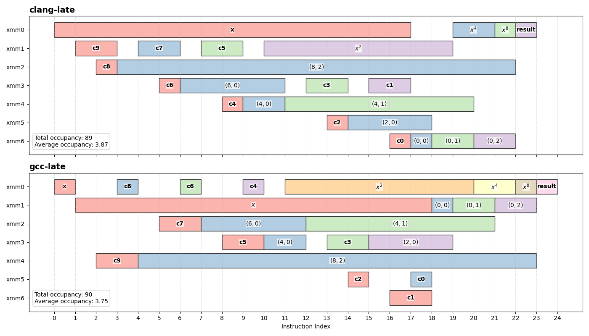
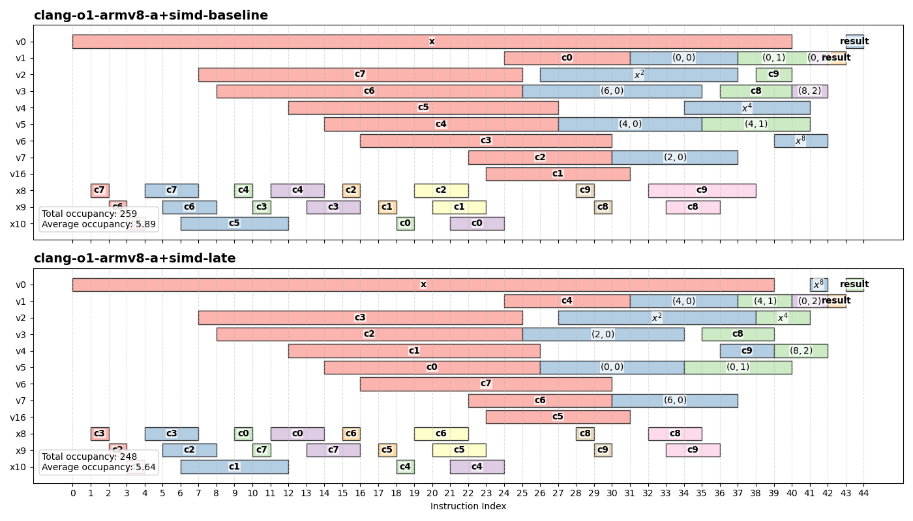
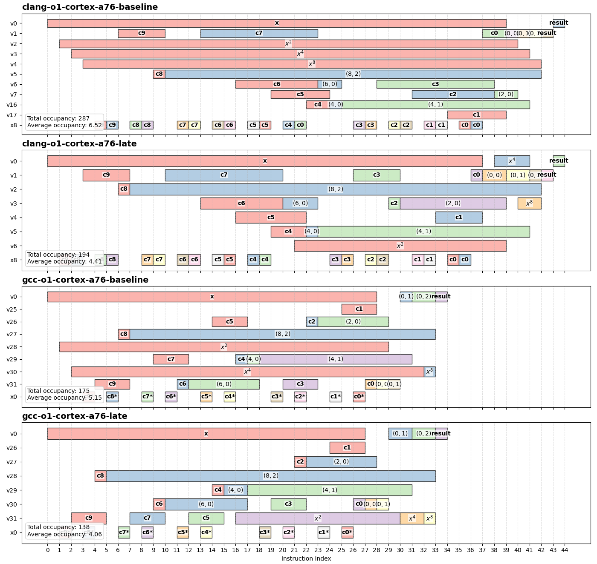
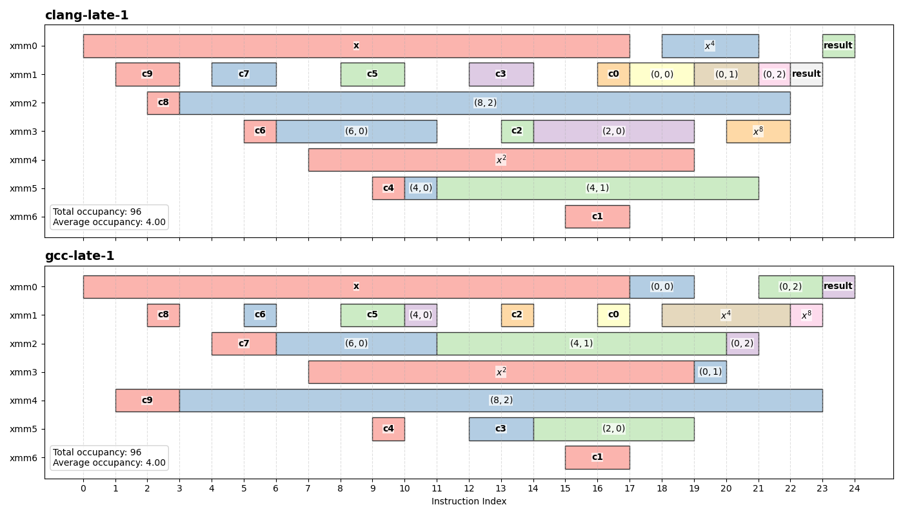
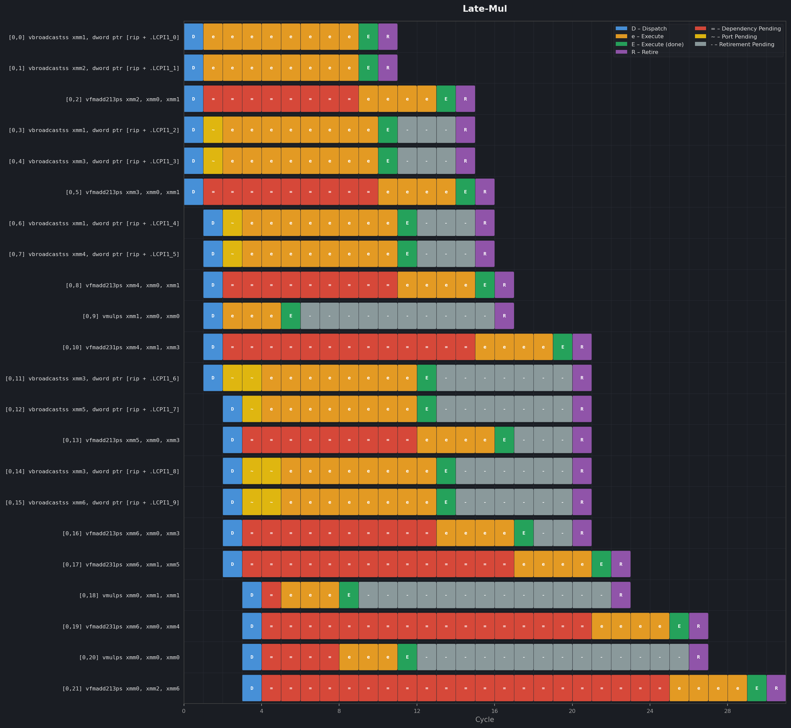
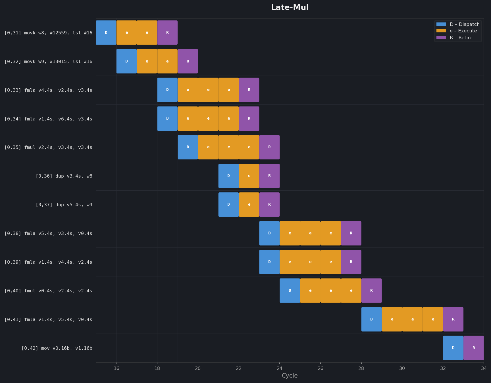
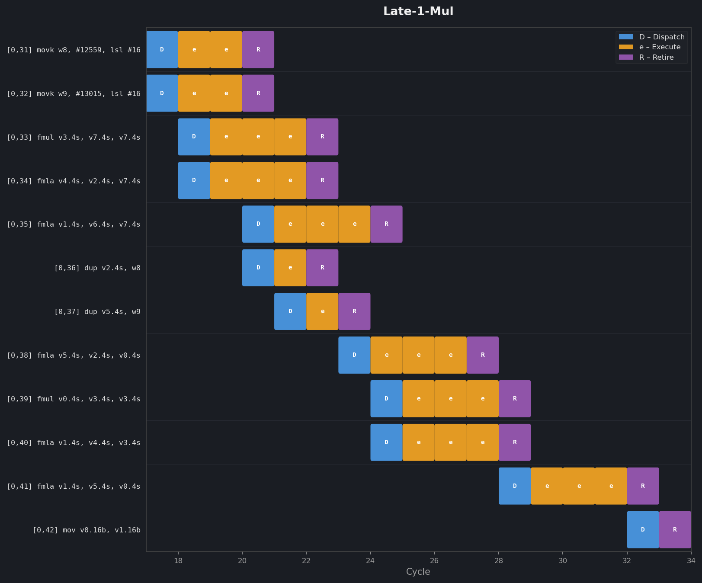

# Defering Squares

The first optimization we can make is to defer $x^{2k}$ evaluations. Recall from the previous chapter, Clang precomputes all the $x^{2k}$ terms up front and GCC precomputes the all but the last one up front. This optimization could potentially improve both compilers' output.

As a first iteration, let us defer it as late as possible, i.e. just before the value is first required. The idea is that on CPUs with out-of-order execution, the latency of these multiplications can often overlap ith independent work already in flight, so the FMA that ends up the results of the multiplications would not actually be stalled. 

The following is simplified pseudocode for clarity. In the actual implementation, this structure is expressed using C++ templates, allowing the recursion and tree traversal to be fully resolved at compile time. For those unfamiliar with C++ templates, you can roughly think of this as a built-in code generator: the compiler expands the recursive structure ahead of time and generates the full Estrin evaluation directly in the final code, without any runtime recursion or traversal overhead.

```python
def estrin(x_powers, coeff, B, L):
    """
    x_powers: [x^1, ?, ?, ?, ...] # partially initialized 
    coeff: polynomial coefficients
    B: base index into coeff
    L: level (depth)
    """

    S =  1 << L # base index stride
    # leaf node
    if L == 0:
        if B + S <= degree:
            return fma(x_powers[0], coeff[B + S], coeff[B])
        else:
            return coeff[B]

    # recursive Estrin split
    if B + S <= degree:
        left  = estrin(x_powers, coeff, B + S, L - 1)
        right = estrin(x_powers, coeff, B,     L - 1)

        # Initialize right before first use
        if B + 4 * S > degree:
            x_powers[L] = x_powers[L - 1] * x_powers[L - 1]

        return fma(x_powers[L], left, right)

    # fallback: skip invalid region
    return estrin(x_powers, coeff, B, L - 1, S >> 1)
```

## Results

### x86

To make sense of these changes, it helps to revisit the lifetime chart.

Recall that this chart tracks how values flow through the computation by showing how long each value remains live in a register. Each horizontal segment represents a value, and its length corresponds to the duration for which it occupies a register.

The following chart shows the lifetime of values for this variant:



GCC's lifetime chart diverges only slightly from its baseline, despite a major structural change (swapping the subtree evaluation order). The overall structure remains similar, but some values have been rearranged.

In particular, the lifetimes of the higher power terms are shorter, and the occupancy metrics are noticably lower, suggesting better register reuse. While the peak register usage remains unchanged, this is still a positive sign, as it indicates that fewer values tend to be live at the same time, which is exactly what we want when trying to reduce register pressure.

Notice that the partial result `(8,2)` now has a much longer lifetime, practically staying alive throughout the whole function. This illustrates a pessimizing effect of swapping the subtree evaluation order: the value is produced early but cannot be consumed until much later, causing it to remain live longer than necessary. While this does not affect the peak in this case, it works against efficient register reuse.

On Clang though, the improvement is clear: the optimized implementation reduces the peak from 9 registers in the Clang baseline to 7, matching GCC's baseline.

### ARM

On ARM, it gets so much more complicated.

The architecture spans a wide range of implementations, from in-order to out-of-order cores, and code generation varies significantly depending on the selected target.

It’s also worth noting that register pressure is generally less restrictive on modern ARM systems compared to x86. AArch64 provides 32 general-purpose registers and 32 SIMD registers per core, which gives the compiler significantly more flexibility when scheduling computations and managing intermediate values. You can see this in the lifetime charts below where the evaluation uses a lot more registers compared to their x86 equivalents.

On ARM, the lifetime charts are also a bit busier as coefficients must first be loaded into general-purpose registers before being broadcast into SIMD registers. In the charts below, general-purpose registers are prefixed with `x` followed by register index and SIMD registers are prefixed with `v` followed by register index.

When compiling on the generic `armv8-a+simd` architecture, from what I can deduce, Clang appears to optimize the generated code for in-order execution CPUs. This makes sense, as it is not uncommon for ARM systems to feature heterogeneous configurations where in-order and out-of-order cores coexist. On these systems, the program needs to run on either type of cores.



In the plots above, both the baseline and the optimized version generates very similar code, with only minor differences in when it loads the coefficients into the SIMD registers relative to the FMAs and multiplications. The $x^{2k}$ multiplications themselves are already deferred, likely to hide latency caused by their data dependencies on in-order CPUs. The register pressure although is reduced by deferring multiplication, it does not change much.

On the other hand, when a specific out-of-order CPU, `-mcpu=cortex-a76`, was set, the assembly changes on Clang are more significant.



For the Cortex-A76, Clang's output ends up quite similar to the x86 assembly, whereby the $x^{2k}$ terms are precomputed up front in the baseline. GCC in contrast, generates the same code for both the generic and A76 target.

For these compiler and target combinations, the optimization does have an effect and the multiplications *are* actually deferred by our code changes. In all cases, the register pressure metrics have been significantly reduced.

It is also worth mentioning that GCC and Clang have different ways of loading the coefficients. GCC loads the coefficients from memory similar to how it is done on the x86 code but Clang on the other hand, synthesizes the floats from 2-byte immediates. Although Clang's generated code ends up being more verbose and uses a lot more registers, it is more performant, especially on in-order cores. The reasons behind this are not immediately obvious, and we won’t dive into them here. I’ll come back to this in a later article.

### Conclusion

In conclusion, through some clever analysis of the Estrin tree and a bit of metaprogramming, we manged to intentionally pushed the $x^{2k}$ multiplications as late as possible to shorten lifetimes of the powers. This had the effect of reducing the register usage, and works on both x86 and ARM despite the modification being less effective on code generated by Clang for in-order CPUs.

That should be good enough, right?

Probably.

## Latency Hiding

When I was *actually* implementing this, I jumped straight into micro-optimizing. In fact, the step-by-step refinement described above only really took shape while writing this article—it made for a more coherent way to explain the progression from a simple solution to a more optimized one.

What actually drove the changes was simpler: I knew the power evaluations needed to be deferred. However, pushing the multiplications to occur immediately before the FMA that consumes their result didn’t sit quite right with me.

At the time, I assumed that out-of-order CPUs could handle this without issue. In principle, the multiplication could be executed well ahead of its use, as long as the hardware could reorder it far enough up the Estrin tree to hide the latency.

My concern was with in-order CPUs. Because the multiplications now occur just before their first use, their latency could become directly visible when execution strictly follows program order.

I didn’t want to leave that as an assumption, I wanted to be sure that this didn't happen (even if I didn't know whether it could).

So after spending more time staring at the Estrin tree, I realized that I could move the multiplication slightly earlier because of a condition that is baked into the structure of the Estrin tree: when a parent node is going to merge and will first read the power.

For trees that evaluate higher-indexed subtrees first[^high-index-first], this happens when:

* `B + 2 * S <= degree`: The parent node will be merging results
* `B + 6 * S > degree`: We are one of the highest-indexed node in a given level
* `B % (4 * S) == 0`: The node we are at is lower-indexed relative to it's sibling

Using these conditions in the implementation:

```python
def estrin(x_powers, coeff, B, L):
    """
    x_powers: [x^1, ?, ?, ?, ...] # partially initialized 
    coeff: polynomial coefficients
    B: base index into coeff
    L: level (log2 stride depth)
    """

    S =  1 << L # base index stride
    degree = len(coeff) - 1
    # leaf node
    if L == 0:
        if B + S <= degree:
            # Initialize power
            if B + 2 * S <= degree and B + 6 * S > degree and B % (4 * S) == 0:
                x_powers[1] = x_powers[0] * x_powers[0]

            return fma(x_powers[0], coeff[B + S], coeff[B])
        else:
            return coeff[B]

    # recursive Estrin split
    if B + S <= degree:
        left  = estrin(x_powers, coeff, B + S, L - 1, S >> 1)
        right = estrin(x_powers, coeff, B,     L - 1, S >> 1)

        # Initialize power
        if B + 2 * S <= degree and B + 6 * S > degree and B % (4 * S) == 0:
            x_powers[L + 1] = x_powers[L] * x_powers[L]

        return fma(x_powers[L], left, right)

    # fallback: skip invalid region
    return estrin(x_powers, coeff, B, L - 1, S >> 1)
```

Which then effectively moved the multiplication exactly 1 instruction up from what it was in the previous case.


### x86

If you actually compiled this code for x86, aside from moving the multiply, you'd barely notice any changes in register use just based on the assembly generated. The lifetime chart on the other hand, tells a slightly different story:



There is no change in peak register usage—the metric remains 7 for both compilers. However, moving the multiplication slightly earlier does increase both the total occupancy and the average occupancy metrics. This is expected, as the power terms are now kept live for slightly longer so that we can create a gap between their production and consumption.

At the time, this still seemed like a worthwhile trade-off: by deferring the multiplication, we increase the chance that its latency can be hidden behind independent work by the pipelined execution. As usual with optimization, there’s no free lunch, only different ways to pay for it. The best we can do is try to strike a reasonable balance.


## Reality Check

So, was the latency hiding actually worth it?

This was a question I didn't know until writing this article.

I needed some way to justify the optmizations I introduced in this article and I stumbled upon a tool in the LLVM suite, llvm-mca, which simulates instruction scheduling on a specific microarchitecture.

For the ease of referencing implementations, I'll be calling the version that defers the multiplication as late as possible `late` and the microoptimized version `late-1`.

First, let's see what happens when we run `late` on x86, specifically on Zen5 (because that's what I use personally).

### Out-Of-Order CPUs



The red blocks in the diagram represent cycles that an instruction is stuck waiting for data dependencies. What we're looking for is: are there any FMAs directly dependent on the multiplications, stuck waiting for the multiplications?

The answer, unsurprisingly, is no.

Thanks to the magic of out-of-order execution, the multiplication started executing so much earlier in the evaluation than one would expect. In fact, *all* the multiplications complete even before the half-way point of the evaluation, practically not affecting the FMAs at all. So my assumption regarding out-of-order CPUs was correct (in this isolated simulation), the only change that moving the multiplication up would introduce is to shift the instruction dispatch (Blue blocks) earlier. Even then, their actual execution will likely remain at the same locations.

### In-Order CPUs

Since all x86-64 supporting FMAs are out-of-order CPUs, for the in-order case, we'd need to look at a different architecture. I chose ARM in this case for no other reason other than I happen to have a small ARM SOC lying around the house. Specifically, the Rockchip RK3588 which has both the Cortex-A55 and Cortex-A76. Although I don't really need an ARM CPU for this, having it just made things a lot easier. For both the following cases, I compiled specifically for an in-order target, `cortex-a55` and simulated it on llvm-mca with the same CPU model.

Focusing on the last ~11 instructions, for the output compiled by Clang, the execution timeline looks something like this:



In the diagram above, since it is an in-order CPU, there isn't any red '=' blocks anymore, instructions can only execute when everything is ready. What we're looking for here is instead *bubbles* in the pipeline. In an ideal in-order pipeline, the every cycle will have at least 1 dispatch block, if the pipeline stalls due to lack of execution units or there is a data dependency, then a 'bubble' forms, where dispatch is delayed until execution units are available and dependencies are resolved; i.e. the dispatch blocks are shifted right.

So what happens when we move the multiplication up by 1 instruction?



Absolutely nothing.

Even at a glance, it’s clear that nothing has really changed. The structure of both the charts remains essentially identical.

The apparent "bubble" introduced by the multiplications *were* removed, but it wasn't on the critical path. Because the multiplications are independent, they can already be pipelined alongside the FMAs, so moving all of them earlier did nothing and the entire evaluation takes the same number of cycles.

Despite the effort, moving the multiplication up didn't actually buy us anything.

## To be continued

While it sucks that my latency-hiding strategy didn't actually improve things, deferring multiplication is only part of the picture.

In the [last aritcle](./02-tuning-baseline.md), we showed that there were 2 orthogonal levers we can pull to reduce register pressure during Estrin evaluations.

[Next time](./04-swapping-subtrees.md), we’ll build on this and explore the other approach in more detail.

