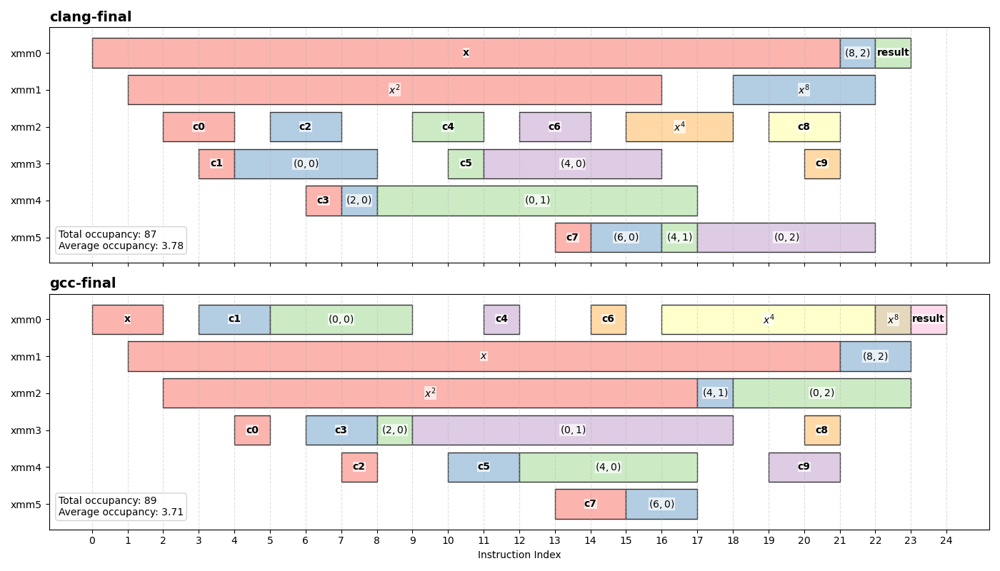
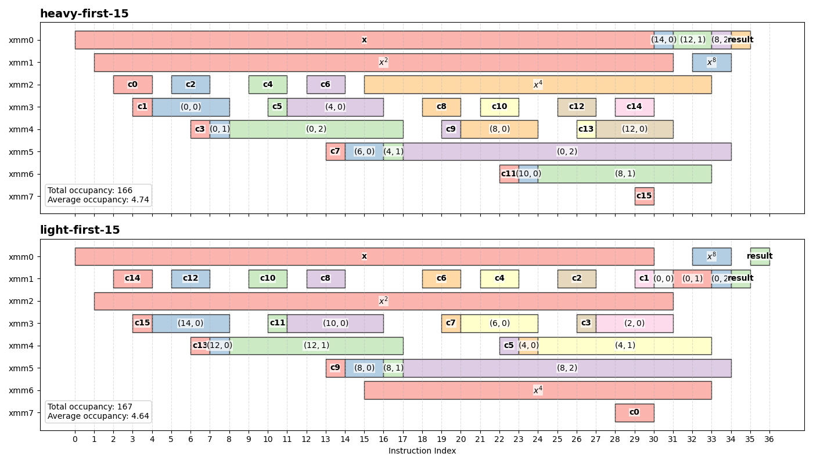
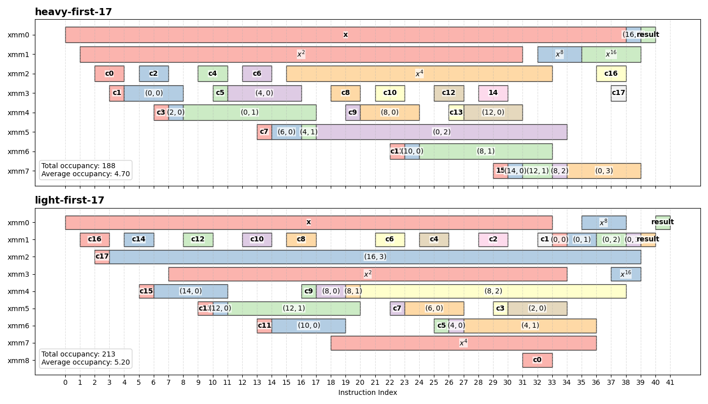

# Swapping Estrin Subtrees

In the [previous chapter](./03-deferred-multiplication.md), we looked at how we can reduce register pressures of Estrin implementations by deferring the computation of the $x^{2k}$ terms. This time, we'll be building upon the results of what we did before.

One of the other ways we can explore is the order in which the Estrin subtrees are evaluated. As discussed [earlier](./02-deferred-multiplication.md), this seems to affect how long some higher-level partial results and $x^{2k}$ terms remain live.

It seemed to work for GCC and it's a relatively simple change, so it's worth a try to see if it actually does anything.

The modified evaluation is shown below:

```python
def estrin(x_powers, coeff, B, L):
    """
    x_powers: [x^1, x^2, ?, ?, ...] # partially initialized 
    coeff: polynomial coefficients
    B: base index into coeff
    L: level (log2 stride)
    """

    S =  1 << L # base index stride
    degree = len(coeff) - 1
    # leaf node
    if L == 0:
        if B + S <= degree:
            return fma(x_powers[0], coeff[B + S], coeff[B])
        else:
            return coeff[B]

    # recursive Estrin split
    if B + S <= degree:
        right = estrin(x_powers, coeff, B,     L - 1, S >> 1)
        left  = estrin(x_powers, coeff, B + S, L - 1, S >> 1)

        # Initialize power
        if B == 2 * S:
            x_powers[L + 1] = x_powers[L] * x_powers[L]

        return fma(x_powers[L], left, right)

    if B == 2 * S:
        x_powers[L + 1] = x_powers[L] * x_powers[L]
    # fallback: skip invalid region
    return estrin(x_powers, coeff, B, L - 1, S >> 1)
```

This introduces two key changes:

1. **Subtree ordering**  
   The heavier subtree is evaluated first. This tends to delay the production of values from the lighter subtree until closer to when they are needed.

2. **Simplified power initialization**  
   The condition for generating higher powers is reduced to `B == 2 * S`, which directly corresponds to the point where the parent node first requires that power.

In addition, $x^2$ is initialized upfront (not shown in the pseudocode), which slightly increases the distance between its production and use. While in theory it can help reduce latency effects of the multiplication, but as shown in the previous chapter, it does not meaningfully affect the execution due to pipelining.

## Results

On x86, the value lifetimes looks something like the following:



Compared to what we had previously:

For comparison, the occupancy metrics of previous metrics are summarized below:

| Variant           | Total Occupancy  | Average Occupancy   |
|------------------|-------------------|---------------------|
| Clang (Baseline) | 129               | 5.38                |
| GCC (Baseline)   | 99                | 4.12                |
| Clang (Late-Mul) | 89                | 3.87                |
| GCC (Late-Mul)   | 90                | 3.75                |

Overall, swapping the evaluation order *does* improve things. Not as much as deferring the multiplication but also not insignificant.

The most notable effect of the modification, is the lifetime of `(8,2)`, which is a partial result from the smaller subtree. This has been drastically reduced—from taking up nearly the entire duration of the function to just a single cycle.

From the chart, we can observe the following:

1. In the baseline, because the lighter subtree has fewer partial results to fold into parent nodes, `(8,2)` is produced early in the evaluation and remains live until its sibling subtree is evaluated.

2. In this reordered version, the heavier subtree continuously folds intermediate results into higher-level partial results. As this occurs, we avoid occupying a register since all results except the last are consumed. Since there is no single long-lived value using up a register during this more demanding phase, we have effectively freed up an additional scratch register for the heavier subtree, reducing peak register usage.

3. Later, when `(8,2)` is eventually evaluated, the remaining computation is lighter and requires fewer scratch registers. As a result, even though the partial result from the heavier subtree `(0,2)` remains live, it no longer contributes to the peak.

As a result, peak register usage was reduced by 1, and the total occupancy has also been slightly reduced.

One register may not seem like a lot, it is the difference between spilling and not spilling onto the stack. So if imbalance is really causing this to occur, then a surprisingly simple improvement may just be to change the evaluation order.

This naturally raises the question:

> Is this just a small, localized improvement, or does it scale with larger and more unbalanced Estrin trees?

The explanation above is reasonable, but the effect is still relatively small in this example. To see whether this behavior becomes more apparent in practice, we'll move beyond the small example and look at a higher-degree polynomial, where the imbalance between subtrees becomes more pronounced.

### 15 Degree

First, as a control, we look at a polynomial of degree 15. In this case, the Estrin tree is perfectly balanced (16 nodes), meaning both subtrees have identical structure and depth. Since neither subtree is heavier than the other, swapping the evaluation order should not have any meaningful effect.

```txt
(B=0,  L=3, S=8)
    ├── (B=8,  L=2, S=4)
    │   ├── (B=12, L=1, S=2)
    │   │   ├── (B=14, L=0, S=1)
    │   │   └── (B=12, L=0, S=1)
    │   └── (B=8,  L=1, S=2)
    │       ├── (B=10, L=0, S=1)
    │       └── (B=8,  L=0, S=1)
    └── (B=0,  L=2, S=4)
        ├── (B=4,  L=1, S=2) *
        │   ├── (B=6,  L=0, S=1)
        │   └── (B=4,  L=0, S=1)
        └── (B=0,  L=1, S=2)
            ├── (B=2,  L=0, S=1)
            └── (B=0,  L=0, S=1)
```



It's a bit unexpected, the chart shows that the lifetimes differs slightly:

- Total occupancy differs by 1, with the light-first policy performing better
- Average occupancy is shown to also perform better with on light-first policy
- There are no differences in peak register use

It seemingly shows that when we evaluate the lighter subtree first, we have slightly better results. However, there are a couple of caveats to this.

Recall that when swapping the subtree evaluation order, one of the additional changes I made was to evaluate $x^2$ at the start of the function. This artificially increased the lifetime of $x^2$ on the chart by 2 blocks for the heavy-first policy.

In addition, since the compiler has no awareness of the tree, there is no guarantee that the generated assembly is identical in both cases. Indeed, notice on the chart that for the light-first policy, the function is extended by 1 block due to the extra move operation at the end of the function, which moves the result to `xmm0` to satisfy the calling convention. This effectively lowers the average occupancy. (It also shows the weakness of considering this metric out of context).

If we consider both these changes, the actual metrics for the light-first policy is 167 total occupancy and about 4.77 average occupancy. These are nearly equivalent to the heavy-first policy, with minor differences noticeable only because the generated eassembly is not exactly identical.

This pretty much demonstrates that subtree ordering alone does not really provide any benefit when the tree is symmetric.

### 17 Degree

Next, we examine a higher-degree polynomial, degree 17, where the Estrin tree becomes *very* unbalanced. In this case, one subtree essentially only has a single node.

```txt
(B=0,  L=4, S=16)
├── (B=16, L=3, S=8)
│   └── (B=16, L=2, S=4)
│       └── (B=16, L=1, S=2)
│           └── (B=16, L=0, S=1)
└── (B=0,  L=3, S=8)
    ├── (B=8,  L=2, S=4)
    │   ├── (B=12, L=1, S=2)
    │   │   ├── (B=14, L=0, S=1)
    │   │   └── (B=12, L=0, S=1)
    │   └── (B=8,  L=1, S=2)
    │       ├── (B=10, L=0, S=1)
    │       └── (B=8,  L=0, S=1)
    └── (B=0,  L=2, S=4)
        ├── (B=4,  L=1, S=2) *
        │   ├── (B=6,  L=0, S=1)
        │   └── (B=4,  L=0, S=1)
        └── (B=0,  L=1, S=2)
            ├── (B=2,  L=0, S=1)
            └── (B=0,  L=0, S=1)
```

The hypothesis is that this node on the light subtree is going to take up one register if it evaluated first. Thereby pushing the heavy subtree evaluation to take up 1 additional register.

To verify this, we repeat the same analysis on the larger unnbalanced tree.



From the chart, we can observe:

- 25 blocks increase in total occupancy on the light-first policy
- As suspected, peak register increased by 1
- ~10% increase in average occupancy on the light-first policy

Like before, the light tree has a couple of "advantages" that should make the metrics look better, e.g. later initialization of $x^2$, having more instructions and so should lower average occupancy. Despite these superficial advatanges, it still performs noticeably worse.

It is also worth mentioning that in the case of extreme imbalance, e.g. degree 16, Clang does indeed swap the subtree evaluations automatically.

Taken together, these results suggest that the effect of swapping subtree evaluations is not universal. It depends on the structure of the tree. When the tree is balanced, subtree ordering has little to no impact. As the tree becomes more asymmetric, however, the benefit becomes increasingly pronounced.

## Next Time

Up to this point, the focus has been on structural transformations—changing how the Estrin tree is evaluated and how intermediate values are produced and consumed. We've introduce two complementary techniques that can help reduce register pressure during Estrin evaluations. 

So far, most of this exploration has been done using Clang at `-O1`. This was largely for convenience: beyond `-O1`, Clang’s output remains effectively unchanged. GCC, however, behaves differently and applies additional transformations at higher optimization levels. To keep comparisons simple, it was also kept at `-O1`.

In the [next chapter](./05-kitchen-sink.md), we revisit this decision. We will look at how different optimization levels—and enabling architecture-specific tuning with `-march=native`—affect the generated code, and how those changes interact with the optimizations explored so far.
