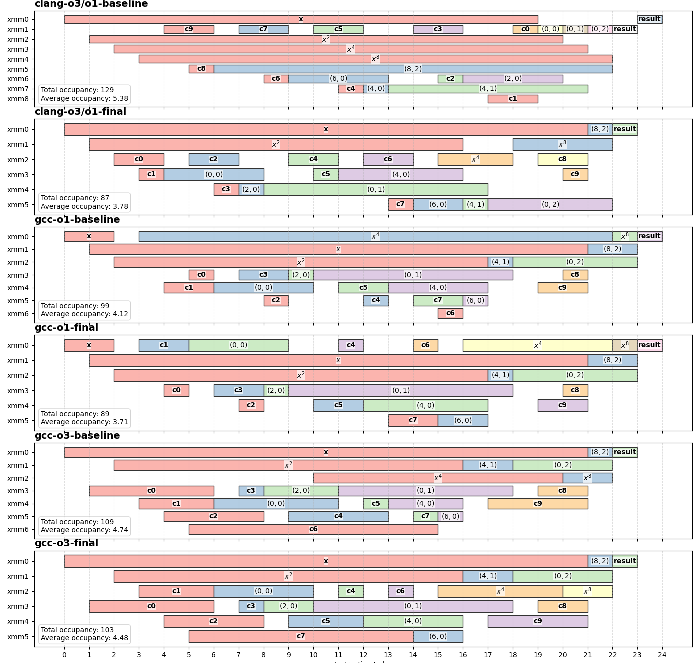
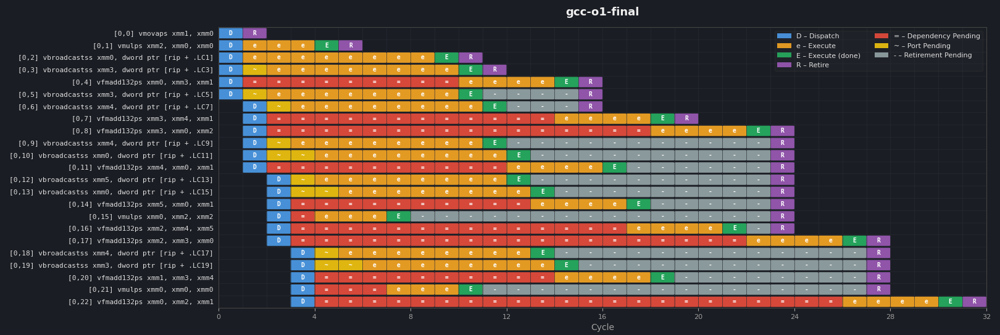
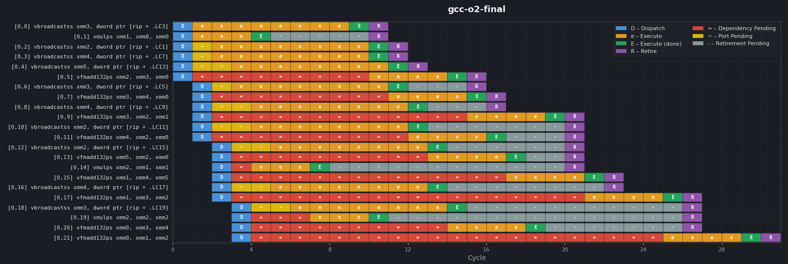
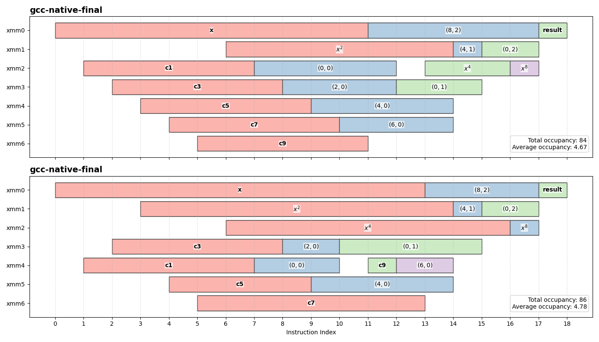
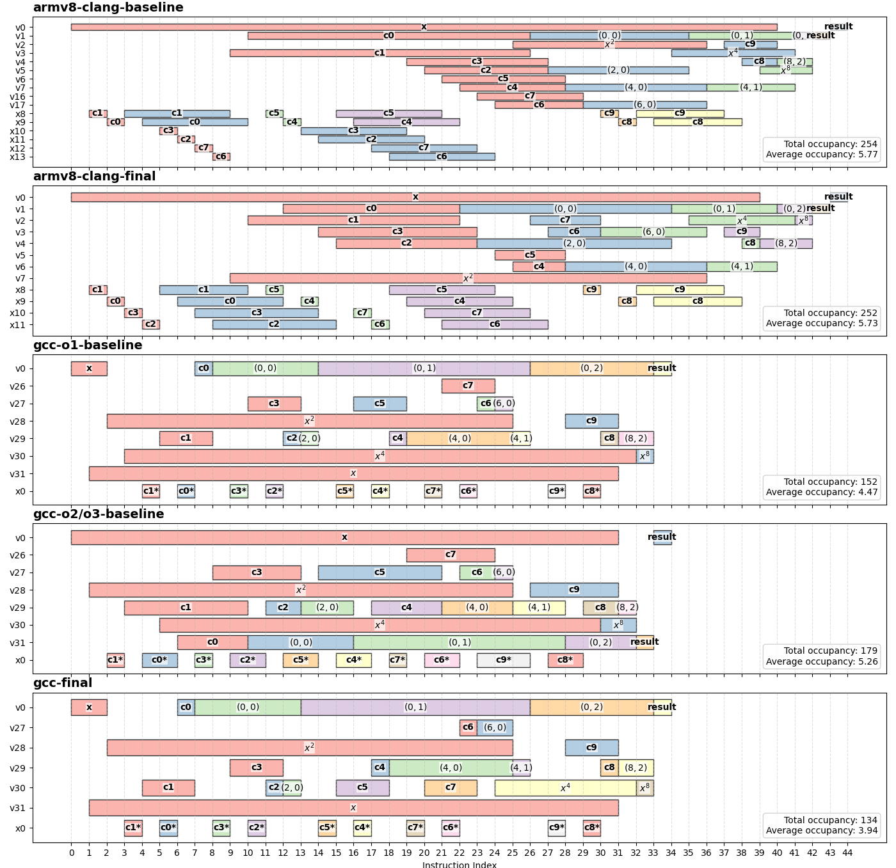
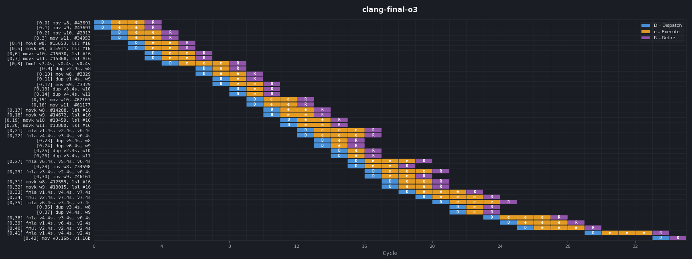
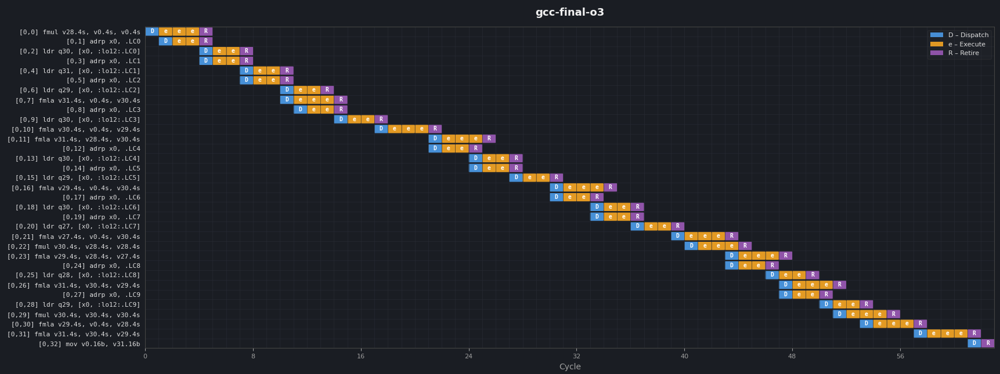
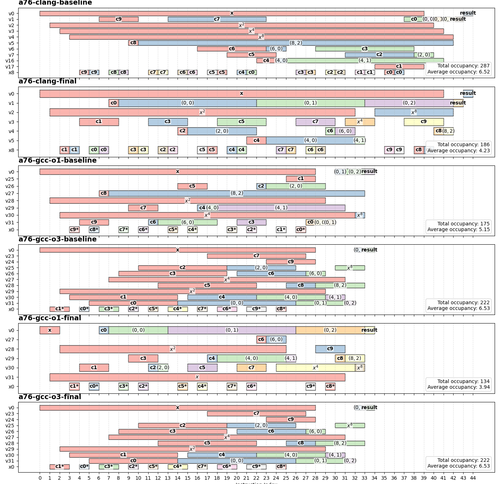

# Kitchen Sink

The previous chapters focused on a specific problem with a specific set of constraints: restructuring the Estrin evaluation to reduce register pressure without changing its output, and without reaching for compiler-specific annotations or build flags. The levers were limited to what C++ itself provides.
This chapter has no such constraints. Having established a reasonable baseline and applied the structural changes, the natural question is: what else is on the table? This is less a focused investigation and more an opportunistic look at a few remaining variables — tweaking optimization levels to see how the compiler responds, and introducing architecture-specific flags to allow it to make use of whatever the target hardware actually supports.

For reference: here is the [compiler explorer link](https://godbolt.org/z/3f5jsGvba).

## Optimization Level

So far, most of the optimization work was done based on Clang's output, and GCC was only briefly examined at `-O1`. I had wrongly assumed that GCC generates the same assembly at all optimization levels based on Clang’s behavior, where the generated code was remained the same above `-O1`.

It wasn’t until I was writing this article that I discovered this assumption to be false. On GCC, the output for baseline *does* change at `-O2`.

So let’s now compare everything with `O3`.

### x86



When compiling the baseline at `-O2`, GCC significantly changes its strategy for the baseline; most notably, by deferring the multiplications that generate the $x^{2k}$ powers, which is exactly the transformation explored. Though increasing the optimization level once again to `-O3` did not change the output at all.

One other difference in GCC’s output at `-O2` and above is that it tends to issue `vbroadcastss` instructions earlier, effectively extending the lifetime of the loaded coefficients.

Comparing the baseline against the final output at `-O3` shows that although we have reduce the peak register use by 1 and reduced the lifetime of the *higher* $x^{2k}$, by loading the coefficients earlier, it resulted in the chart becoming "busier".

I am not entirely sure how beneficial this is. When running `llvm-mca` for AMD's Zen5 architecture, the instruction timeline shows that due to high throughput combined with out-of-order execution, moving some of the load instruction `vbroadcastss` up, doesn't achieve much.





However, this could be because I simulated the code in isolation, i.e. looping just the polynomial instructions over and over. It's *possible* that profiling this with a more realistic example could show some differences, but it is also likely that the code changes depending on the surrounding context the polynomial is evaluated in.

GCC’s strategy highlights a different point in the trade-off space: it is willing to accept higher register pressure in exchange for more aggressive latency hiding. In contrast, the transformations explored here focus on reducing the number of simultaneously live values, even if that leaves some latency management (if any) to the hardware.

Whether or not this trade-off is worth it, likely depends more on the actual use-case of the polynomial. Or, it just makes no difference. I might be biased, but I prefer the output for `final` at `-O1`.

#### Host Optimization

I happen to own an AVX512 enabled CPU for my personal use, specifically the AMD Zen5 Ryzen 9 9950x3D, so naturally I wondered what would happen if I compiled everything with `-march=native`.

The results did not disappoint.



Although peak register usage did not change, the total number we need has been effectively halved. 

As it turns out, in AVX512-enabled CPUs, the FMA functions can accepts a memory address (pointer) to a scalar as it's second source operand (third argument). The CPU will then internally perform the broadcasted memory load during the FMA's execution. At this point, register pressure is no longer an issue for 2 reasons:

1. The number of architectural registers needed by the computation drops significantly because many temporary broadcast registers disappear entirely.
2. AVX512 doubles the SIMD register count from 16 to 32 architectural registers.

Combined, this effectively reduced the relative register pressure by roughly 4 fold.

That said, this does not come completely for free. Although this implementation reduces both instruction count and architectural register pressure, the FMA instructions themselves decode into more of what's called [micro-ops (μops)](https://en.wikipedia.org/wiki/Micro-operation) internally than the basic FMAs. In other words, some of the work we did explicitly in the more general implementation has effectively been moved inside the instruction itself which may either require more execution resources to perform or compete with other instrucitons for execution resources.

Whether this tradeoff is worth it needs to be measured in the actual code using the polynomial.

In addition, AVX512 CPUs are relatively limited outside server, workstation, and enthusiast-class CPUs. Many mainstream consumer-grade CPUs still lack these extensions due to how power hungry they are, so it is difficult to rely on this behaviour universally.

Without AVX512 however, there seems to be a similar feature.

Upon first compiling the code with `-march=native`, I didn't really understand what was going on and  I took a brief look at the [documentation](https://www.felixcloutier.com/x86/vfmadd132ps:vfmadd213ps:vfmadd231ps) for the FMA instructions of x86.

It turns out that even the non-AVX512 FMA instructions can accept a memory operand as the second source operand (third argument). Unlike the AVX512 version though this one does not perform a broadcasted load, and instead is just a normal vector memory load.

This means that *if* we were to tune our code to enable the compiler to do this, it may increase our binary size required for the polynomial functions since all even-indexed coefficients (which are ALWAYS passed as the thrid argument of the FMA), must be duplicated to match the full SIMD register width in memory.

| SIMD Width | Precision  | Replication Factor |
|------------|------------|--------------------|
| 128-bit    | Double (`f64`) | 2× |
| 128-bit    | Single (`f32`) | 4× |
| 256-bit    | Double (`f64`) | 4× |
| 256-bit    | Single (`f32`) | 8× |

> 512-bit vectors are excluded here since AVX512 provides broadcasted memory operands directly in the FMA instructions, making full-width duplicated constants unnecessary.

As a quick experiment, I tried a few approaches off the top of my head to see whether I could convince the compiler to generate to use the memory load, but ultimately was unsuccessful. To be honest, I didn't even try that hard as I am not convinced that this would actually be a good default strategy for DPL.

This kind of tuning starts becoming extremely architecture- and compiler-specific. Although it *is* possible to perform conditional compilation using many of the [preprocessor flags](../../include/dpl/configuration/) that DPL defines, over-specializing the implementation risks making the code less adaptable overall. We would effectively be forcing the compiler down one optimization path instead of allowing it to optimize based on the surrounding context in which the polynomial evaluation is ultimately used.

### ARM

As before, collecting data for ARM is somewhat more complicated due to the large number of possible configurations. There are multiple optimization levels (`-O1` through `-O3`), generic architectural targets such as `-march=armv8-a+simd`, and specific CPU targets such as `-mcpu=cortex-a55` or `-mcpu=cortex-a76`, each of which can produce noticeably different code generation strategies.

#### In-Order



A quick recap on ARM assembly (aarch64), the instructions require loading the coefficients' value into general purpose registers (prefixed with 'x') before being broadcasted to the SIMD registers (prefixed with 'v'). Each core has 31 general purpose registers and 32 SIMD registers. So despite looking much busier, ARM has a lot more registers than x86. This is also why the compiler ended up generating code that liberally loads in the coefficients; since ARM has more registers, register pressure isn't prioritized as much.

For the generic ARMv8 target, `-march=armv8-a+simd`, the differences across optimization levels are relatively small and broadly similar to what we observed on x86.

Clang generates essentially identical code from `-O1` through `-O3`. GCC, on the other hand, does introduce some changes at `-O2`, although they are fairly minor in this particular case. Most of the differences come from small shifts in coefficient loading order within the baseline implementation rather than any major restructuring of the computation itself. Beyond `-O2`, GCC’s output remains unchanged at `-O3`.

Compiling specifically for the Cortex A55 via `-mcpu=cortex-a55` produces similarly small differences, although those results are not shown in the plots above. The generated assembly is not identical, but the changes are mostly limited to slightly different coefficient loading schedules and instruction ordering rather than fundamentally different evaluation strategies.

Another difference between Clang and GCC is how they materialize the polynomial coefficients. The lifetime charts make this visually obvious, although the reason is not immediately clear.

GCC uses a strategy more similar to x86: coefficients are loaded from memory. On AArch64, this typically involves first computing an address relative to the program counter using an `adrp` instruction, followed by a load from that address. This is why the lifetime chart contains the additional `cn*` blocks corresponding to temporary address calculations.

A side effect of GCC’s approach is increased binary size. Since the coefficients are loaded directly into SIMD registers, the constants often need to be replicated to match the width of the SIMD register. For single-precision coefficients, this means the same 32-bit float may be duplicated across all four lanes of a 128-bit vector constant in memory.

Clang, in contrast, prefers to synthesize many of the coefficients directly from immediates. Given a floating-point constant, Clang splits the bit-pattern into two 16-bit immediates and reconstructs the value using integer instructions before moving it into a SIMD register. The immediates are limited to 16 bits because AArch64 instructions are fixed-width 32-bit instructions, leaving only a limited amount of space for embedded constants.

Conceptually, the generated sequence behaves roughly like:

```python
val = (imm1 << 16) | imm0
```

However, the instruction sequence used by Clang to combine the two 16-bit immediates is not truly dependent in the same way as the pseudocode would imply. The sequence works by using an instruction that patches in the upper 16-bits directly without reading the previous register value, so the processor does not need to wait for the first write to retire before issuing it. Essentially, it is more like:

```python
val.lo = imm0
val.hi = imm1
```
While it may seem like Clang is slower due to having more instructions, in actuality, Clang generated code is faster, especially on in-order CPUs like the ARM Cortex A55.

The reason is that the load from memory sequence used by GCC has relatively high latency and limited throughput. The integer instructions used for constant synthesis, on the other hand, are cheap, highly pipelinable, and can often execute while other operations are already in flight. On in-order cores, avoiding memory operations is especially valuable because there are fewer opportunities to hide load latency behind unrelated work.

This becomes much more apparent when looking at the llvm-mca timelines for the Cortex A55 below.





In the Clang timeline, the function finishes in a little over half the number of cycles required by the GCC implementation. 

You can also see that the upper and lower 16-bit portions of the constant are effectively being materialized into the same architectural register without waiting for the previous write to retire. The `movk` instructions simply patch in the higher 16-bit, allowing the backend to keep the constant synthesis pipeline moving with very little serialization.

The GCC code could probably be improved somewhat by restructuring the address-generation and load sequence — for example, issuing a batch of `adrp` instructions first and then pipelining the loads afterward. Honestly, I did not dig into this path too deeply.

More importantly, unless you know ahead of time that the code will only ever be compiled with GCC for an in-order ARM CPU, this probably is not worth overtuning for. If anything, the more interesting direction would probably be figuring out how to encourage GCC to generate code closer to Clang’s constant-synthesis strategy instead. But that is a rabbit hole for another day, so I will leave that as an exercise to the reader.

#### Out-of-Order

For the out-of-order CPU, the lifetime charts were plotted with code generated by Clang and GCC when compiled with `-mcpu=cortex-a76`. These has been shown to vary slightly with increasing optimization levels, so no new insights here.



In general, two effects are introduced:

1. Deferral of the multiplications that generate the $x^{2k}$ terms
2. The computation is split into a loading phase which loads most if not all of the coefficients before evaluating the FMAs; the higher the optimization level the more coefficients are loaded

One interesting effect shown on the lifetime chart is that with `-O3`, the `baseline` and `final` implementation ends up pretty much identical.

Ultimately, not much differences are observed aside from different decisions regarding the multiplication for the A76 compared to the A55 as discussed in a [previous chapter](./03-deferred-multiplication.md) as well as the differences in how the coefficients are loaded between Clang and GCC.

## Conclusion

Overall, outside of the AVX512 case, the normal optimization levels already do a reasonably good job. Most of the generated code remains structurally very similar, and the transformations explored throughout this series continue to behave roughly as expected across the different compiler settings and architectures tested.

The AVX512 variant is definitely the most dramatic result, but even there it is difficult to declare it universally better. The reduction in live-values in registers and instruction count comes with different characteristics and tradeoffs, so whether it actually improves things still needs to be evaluated on a case-by-case basis within the real workload using the polynomial.

It is also difficult to say that the transformations explored throughout this series are universally beneficial on ARM.

As mentioned earlier, ARM has a lot more architectural registers compared to x86, and the lifetime charts clearly show the compiler taking advantage of this. In some cases, particularly Clang targeting in-order cores, the optimizer may even decide to bypass most of the things we've done and generate code that looks nearly identical to the baseline implementation.

I don't think that this means the transformations are pointless though.

What we *have* shown is that the compiler is still able to understand and utilize these transformations to generate code. On targets where reducing register pressure matters more, the transformations naturally lower register usage and shorten lifetimes as intended. On targets where register pressure is already less constrained, the compiler often simply folds the changes away or converges back toward the baseline structure.

If anything, that is probably a good sign. It suggests the implementation remains flexible rather than being so aggressively overtuned that the compiler loses the ability to optimize around it.

And honestly, that flexibility ended up becoming one of the more interesting takeaways from this whole exploration.

When I first started implementing DPL, many of these transformations simply *felt* like they should help. That intuition came mostly from my own mental model of how C++ maps onto hardware. The problem is that there are still aspects of the hardware, e.g. instruction pipelining, register renaming, dependency chains, etc. that isn't really exposed by the language and it's easy to build incomplete or even incorrect intuition around how things actually execute. In the end, things may end up having little to no measurable impact on performance.

Working through these optimizations forced me to figure out how to evaluate them properly instead of relying purely on instinct. Along the way, I ended up learning how to use tools like LLVM-MCA, digging deeper into compiler output, and even devicing a way to visualize register lifetimes across the evaluation (even if most of it was hardcoded by an LLM). Those are probably things I would never have explored otherwise.

It also helped clarify how much modern CPUs already do on their own. Whether in-order or out-of-order, they are very effective at overlapping independent work, and not every apparent inefficiency translates into a real bottleneck.

So while not every optimization made things faster, they did improve something else: the mental model of how the code (or in this case how it *doesn't*) maps onto the hardware . And that, I think is more valuable in the long run.

